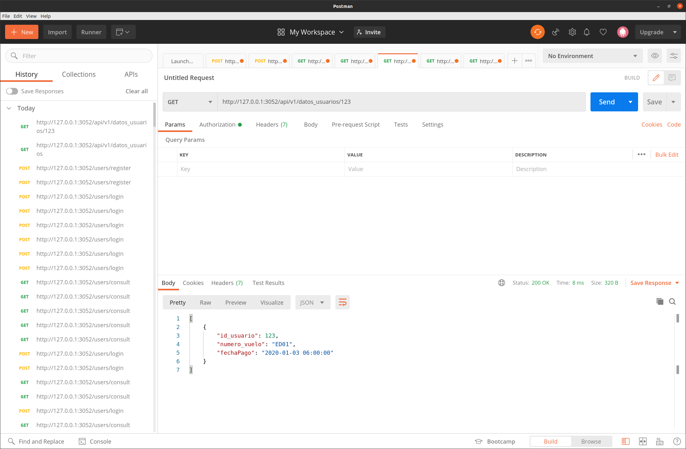

# Sistema de reserva de vuelos

El sistema de reservaciones de vuelos permite al usuario hacer consultas y reservaciones de vuelos, además de poder comprar los boletos aéreos de forma remota sin la necesidad de recurrir a un agente de viajes.

## Cómo instalar este proyecto

1. Corre este script para instalar el proyecto

```
sudo ./install.sh
```

2. Crear la base de datos con esta línea de código:

```
cat bd.sql | sudo mysql -uroot -p
```

3. Esta API utiliza estas variables de entorno, para correr la aplicación, conteniendo las credenciales de la base de datos, el token, el host y el puerto de ejecución

```
PORT=3052
PASSWORD_TOKEN=miclave
HOST=localhost
USER_DB=vuelos
PASSWORD_DB=Vuelos_01
NAME_DATA_BAASE=aerolinea
```

## Correr la API

1. Muévete a la carpeta backend/src y ejecuta el código

```
node .
```

2. Abre otro bash y muévete a la carpeta frontend/my-app y ejecuta el código

```
npm start
```

## Funcionamiento de la API:

NOTA: para modificar, o crear datos desde cero debes iniciar sessión con el token.

1. Registro


2. Login
   

3. Consulta de la informacion de vuelos por persona
   

4. Consulta detallada de un vuelo en específico o también se podría realizar la consulta de todos los vuelos
   

5. Información del usuario
   

### Funcionamiento para el cliente final (frontend)

Aun en desarrollo

## Autor

- **Edison Isaza** - [peluza](https://github.com/peluza)
